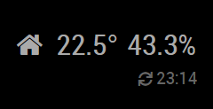
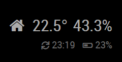
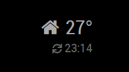
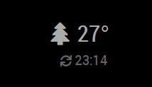
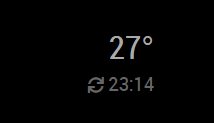
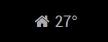
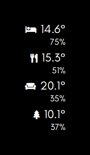

# mmm-RemoteTemp

This module is for [MagicMirror²](https://github.com/MichMich/MagicMirror/) to display temperature, humidity, and/or battery, values from a remote sensor. Any external Smart Home System capable of sending a POST with the values via HTTP protocol.

## Features

By default this module displays the measured temperature, humidity, an icon and the time of the last update:



If the sensor sends battery level data, it can be displayed in the second line:



If the sensor does not send humidity data, then only the temperature is displayed:



You can configure the module to display a custom icon:



If you wish, you can completely remove the icon:



You can also hide the second line:



This module is capable to display only a single temperature value. If you would like to see the value of more sensors on your mirror, add this module multiple times.

For updates, please check the [CHANGELOG](https://github.com/JC-Reno/MMM-RemoteTemp/blob/master/CHANGELOG.md).


## Installation

In your terminal, go to your [MagicMirror²][mm] Module folder and clone mmm-RemoteTemp:

```bash
      cd ~/MagicMirror/modules
      git clone https://github.com/JC-Reno/MMM-RemoteTemp.git
```

### Update

```bash
cd ~/MagicMirror/modules/MMM-RemoteTemp
git pull
```

## Using the module

To use this module, add it to the modules array in the `config/config.js` file:

```js
    {
        module: 'mmm-RemoteTemp',
        position: 'lower_third'
    },
```

Or you could use all the options:

```js
    {
    module: "MMM-RemoteTemp",
    disabled: false,
    position: 'lower_third',
    config: {
        sensorId: "office",
        icon: "briefcase",
        showMore: true
    },

```js
    {
        module: 'mmm-RemoteTemp',
        position: 'lower_third',
        config: {
            exampleContent: 'Welcome world',
            showTemperature: true,
            showHumidity: true
        }
    },
```

## Configuration options

| Option     | Description
|------------|-----------
| `sensorId` | **REQUIRED** An arbitrary value that determines from which sensor this module accepts updates. It can also be used as an API key to restrict access to your mirror.<br><br> **Type:** `string` <br>**Default value:** `null` (must be configured)
| `icon`     | *Optional* Name of a [FontAwesome icon](https://fontawesome.com/icons?d=gallery) that is displayed before the temperature value. For example set to `'home'` to indicate that the mirror displays an indoor value or `'car'` if you show the temperature your car enjoys in the garage. You can set it to `null` to not display any symbol. <br><br> **Type:** `string` <br>**Default value:** `'home'`
| `showMore` | *Optional* Determines whether a second line with additional data (e.g. timestamp of the last data update and battery level) should be displayed on the mirror. <br><br> **Type:** `boolean` <br>**Default value:** `true`

## Sending notifications to the module

This module creates a new HTTP endpoint on the mirror's webserver, which handles HTTP POST requests sent by the remote sensors. The HTTP request must contain the temperature data measured by the sensor and the unique identifier you assigned to the sensor. The module displays the measured value only if the configured `sensorId` matches the value received in the request.

It is up to the sensor to define how often it updates the measured data, the mirror will display the last received value.

## Sensor requirements and communication

This module can work with any temperature sensor that is capable to periodically send HTTP POST requests with the following standard JSON body to the `http://<your mirror's IP>:8080/remote-temperature` endpoint:

```javascript
{
  "temp": 27,
  "humidity": 30.4,
  "battery": 100,
  "sensorId": "1"
}
```

The `temp` property value is optional, must be a `number`, and must contain the measured temperature. It will be displayed on the mirror as is, without any conversion, appended by the `°` symbol.

The `humidity` property value is optional, but if specified, it must be a number, and must contain the measured humidity represented in percentage. It will be displayed on the mirror as is, without any conversion, appended by the `%` symbol.

The `battery` property value is optional, but if specified, it must be a number, and must contain the measured battery load represented in percentage. It will be displayed on the mirror as is, without any conversion, appended by the `%` symbol.

The `sensorId` property must be a `string`, and can contain any value, but it is important that it must match the `sensorId` specified for the module in the configuration. It is used to determine which module should display the value, if the module is added multiple times to the mirror. It can also be used as an API key to ensure that only authorized sensors can update the mirror.

Make sure that your sensor properly sets the `Content-Type` header in the HTTP request to `application/json`, otherwise the module will not be able to parse the request body.


## Developer commands

- `npm install` - Install devDependencies like ESLint.
- `npm run lint` - Run linting and formatter checks.
- `npm run lint:fix` - Fix linting and formatter issues.


## Customization

The module includes CSS classes for each of the elements in the display allowing you to have a high level of control over the appearance of the module. The classes are:

- `symbol`: icon (if used)
- `temp`: temperature value (if used)
- `humidity`: humidity value (if used)
- `battery`: battery load value (if used)
- `time`: last data update time (if used)

If you want to adjust the size of various elements, one option is to use the `zoom` property. This allows you to enlarge/reduce multiple elements at the same time. For example, the following would reduce everything in the module by 75%:

```css
.MMM-RemoteTemp {
  zoom: 0.75;
}
```

By using the `::after` selector you can also move elements onto separate lines. For example, the following would put the humidity on a separate line below the temperature:

```css
.MMM-RemoteTemp .temp::after {
  content: "\a";
  white-space: pre;
}
```
*NB: the timestamp is pushed down onto a separate line by default*

Putting all of these formatting elements together, you can make a very compact layout if you want to stack the output from multiple sensors. For example:

```css
.MMM-RemoteTemp {
  zoom: 0.75;
  line-height: 1em;
  margin-bottom: 10px;
}

.MMM-RemoteTemp .symbol,
.MMM-RemoteTemp .humidity,
.MMM-RemoteTemp .time {
  zoom: 0.75;
}

.MMM-RemoteTemp .temp::after {
  content: "\a";
  white-space: pre;
}
```
creates this:


